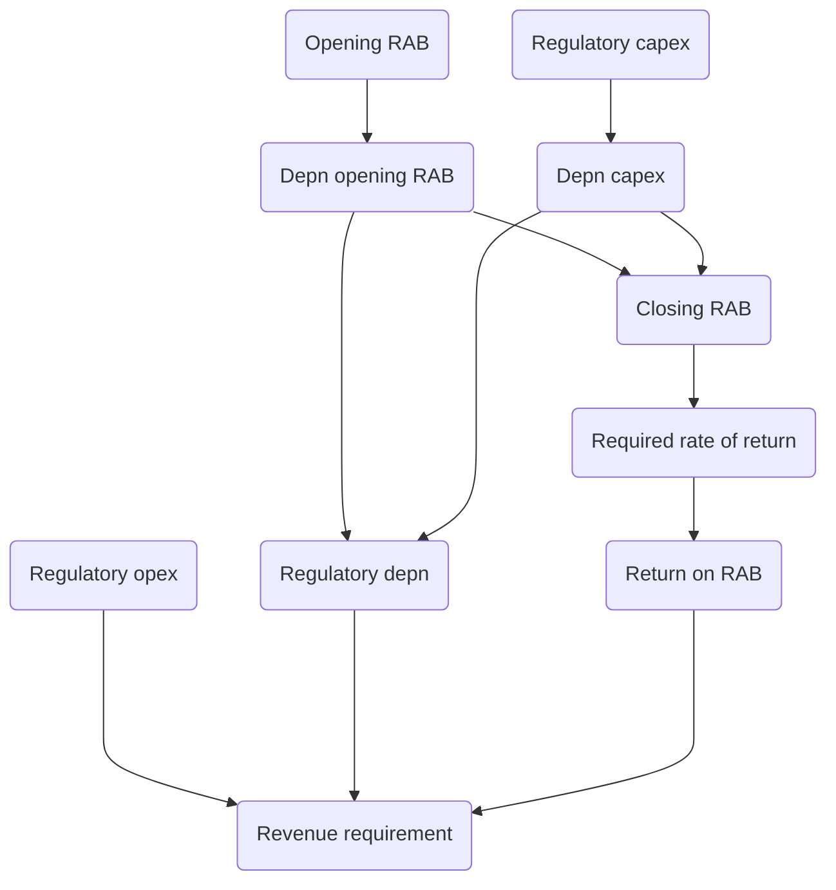

# Building-Block
The building block model, when applied correctly and consistently over time, ensures that the firm earns a revenue stream with a present value equal to the present value of its expenditure stream. 

